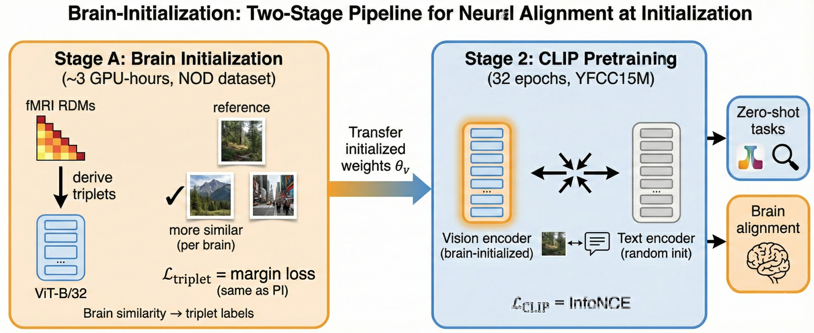
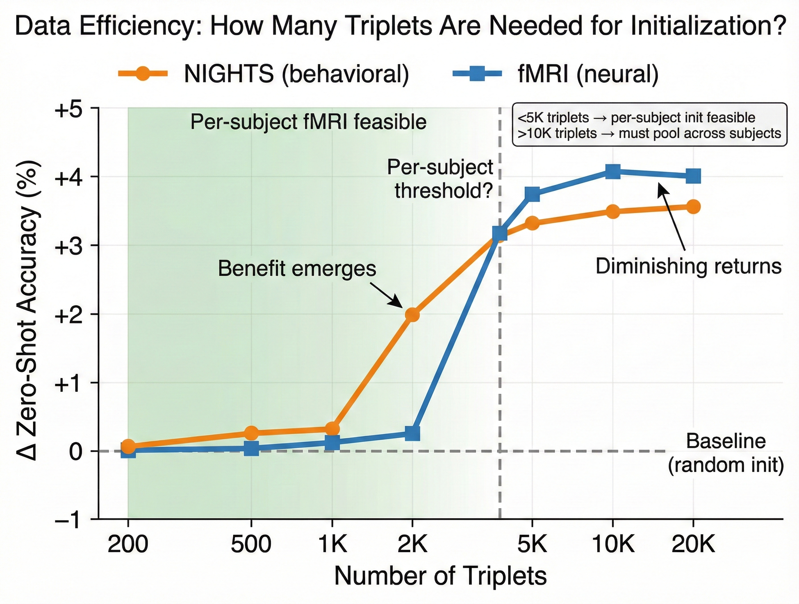
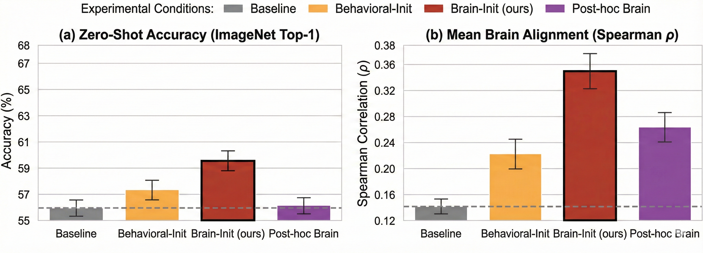
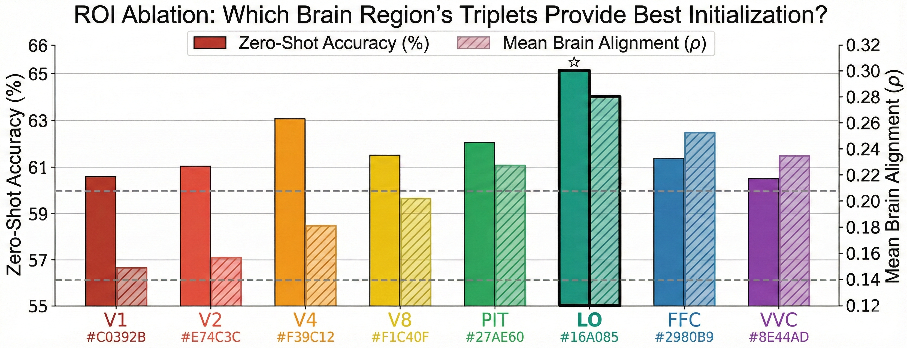
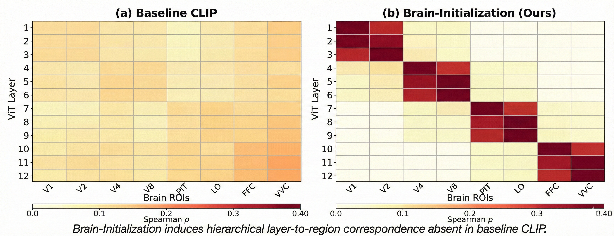
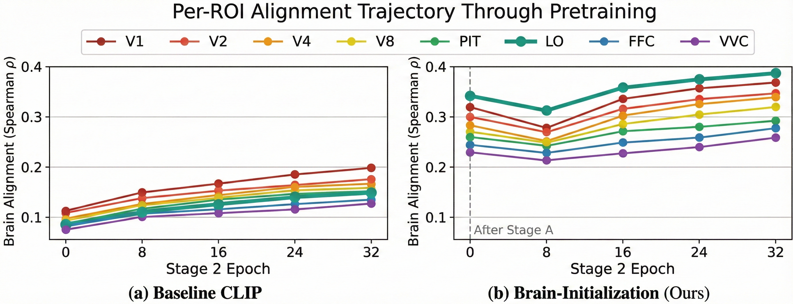
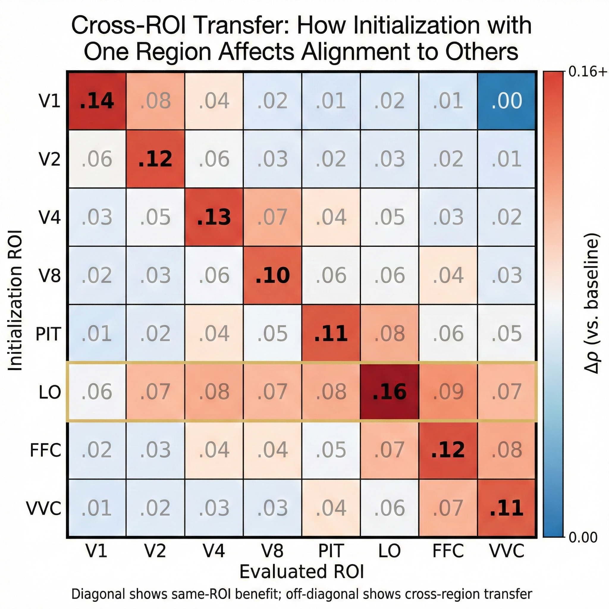
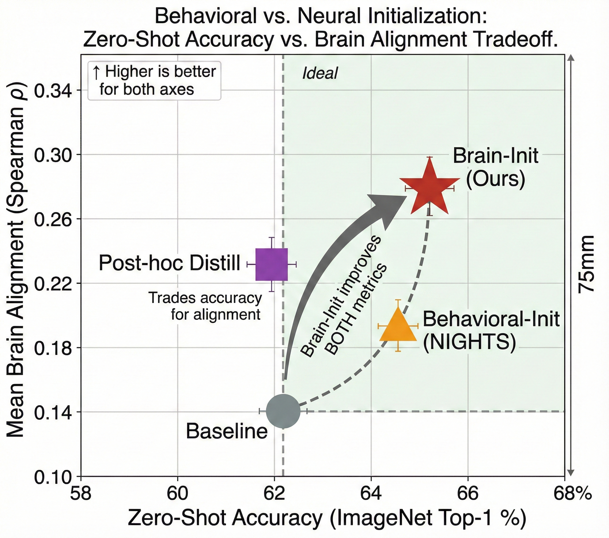
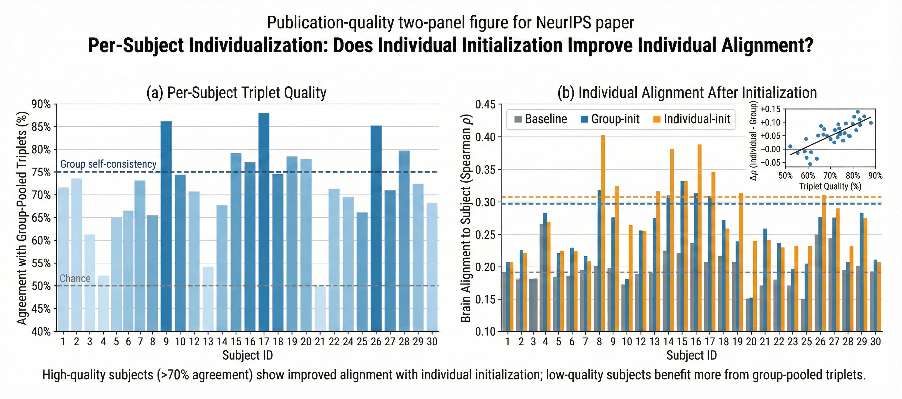

# BRAIN-INITIALIZATION PROJECT PLAN

---

## Page 1

BRAIN_INITIALIZATION_PROJECT_PLAN.md
2026-02-04
1 / 42

# Brain-Initialization CLIP: Neural Alignment at the Origin of Representation Learning

## 10-Week NeurIPS 2026 Submission Plan

**Start: Feb 3, 2026 | Plan End: Apr 13, 2026 | NeurIPS Deadline: ~May 15, 2026 (~4 weeks buffer)**

---

## Constraints & Assets

**Dataset:** NOD (Natural Object Dataset, ds004496) — 30 subjects, 57,120 images, HCP-MMP parcellation (V1, V2, V3, V4, V8, VMV, PIT, LO, FFC, VVC). Already downloaded and processed into RDMs.

**Pretraining data:** YFCC15M — already downloaded. Training script for perceptual initialization exists.

**Compute:** 6 A100s + 4 A6000s (~8.6 A100-equivalents). ~14,400 A100-equivalent GPU-hours over 10 weeks.

**Prior code:**
- Existing perceptual initialization training script (from arXiv 2505.14204 replication) — directly reusable, just swap triplet source
- NOD fMRI RDMs for constructing brain-derived triplets

**Key insight from arXiv 2505.14204 (Perceptual-Initialization):** Behavioral triplet judgments at initialization yield better zero-shot performance than post-hoc fine-tuning. We extend this by using fMRI-derived triplets — instead of human 2AFC judgments, we use brain response similarity (from RDMs) to determine which image is "more similar" to the reference.

**Research questions:**
1. Does fMRI-based initialization improve zero-shot performance and brain alignment vs. random initialization?
2. Which brain ROIs provide the most beneficial initialization signal?
3. **How many triplets are needed for effective initialization?** (Data efficiency ablation on PI first, then apply to Brain-Init)
4. Does initializing with an individual's triplets produce better alignment with that individual's brain than group-pooled initialization (triplets pooled across all subjects)?
5. How does neural initialization (fMRI) compare to behavioral initialization (triplets)?

**Critical preliminary question:** The NIGHTS dataset has ~20K triplets. NOD has 57K images → potentially millions of triplets, but per-subject signal may be noisy. We need to establish the minimum triplet count for PI to work, then assess whether per-subject fMRI provides enough reliable triplets.

---

## Compute Strategy

With 10 GPUs (6 A100 + 4 A6000), we run experiments in parallel: A100s handle full-scale runs while A6000s run reduced-scale ablations simultaneously.

| Experiment Type | Scale | GPU-Hours | Runs On |
|-----------------|-------|-----------|---------|
| Reduced-scale ablations (YFCC-3M, 16 epochs) | ~1/5th | ~800 each | A6000s |
| Full-scale runs (YFCC15M, 32 epochs) | Full | ~4,200 each | A100s |
| Per-subject initialization ablation | ~1/5th | ~800 each | A6000s |

**Budget allocation:**
- 3 full-scale runs (main method, baseline, behavioral-init comparison): ~12,600 GPU-hours on A100s
- 8 reduced-scale ROI ablations (16 epochs each): ~6,400 GPU-hours on A6000s
- Per-subject initialization ablation (subset of subjects): ~2,400 GPU-hours on A6000s
- Eval/debugging overhead: ~1,500 GPU-hours
- **Total:** ~22,900 GPU-hours — tight, requires staggered scheduling and prioritization

**Note:** 16-epoch reduced-scale runs are necessary because PI effects didn't emerge until ~epoch 16.

---

## Page 2

BRAIN_INITIALIZATION_PROJECT_PLAN.md
2026-02-04
2 / 42

---

## Phase 1: Infrastructure & Initialization Validation (Week 1)

### Week 1 (Feb 3 - Feb 9) — Data Efficiency Ablation & Pipeline Setup

**Critical first step:** Before investing in Brain-Init, we need to know how many triplets PI requires. This week runs a data efficiency ablation on NIGHTS to establish the minimum viable triplet count.

**Deliverables:**

1. **PI Data Efficiency Ablation (runs on A6000s in parallel with setup):**
   - Train PI with varying fractions of NIGHTS triplets: 1%, 5%, 10%, 25%, 50%, 100%
   - For each: Stage A (triplet init) → 16 epochs YFCC-3M → evaluate zero-shot
   - **Note:** 16 epochs required — PI effects didn't emerge until ~epoch 16 in original paper
   - Plot: zero-shot accuracy vs. triplet count
   - **Key question:** At what triplet count does PI benefit saturate or emerge?
   - This tells us the "minimum viable signal" for triplet-based initialization

2. Repo structure scaffolded and existing code integrated:
```
src/
  data/       # loaders for YFCC15M (existing), NOD fMRI RDMs (existing)
  models/     # ViT-B/32 with initialization hooks
  losses/     # triplet margin loss (from PI)
  training/   # brain_init_trainer (NEW), clip_pretrainer (existing)
  evaluation/ # zero-shot, retrieval, brain alignment, NIGHTS triplet acc
  analysis/   # ROI ablation, individualization analysis, figures
configs/      # experiment YAML configs
scripts/      # launch scripts
```

2. Verify YFCC15M + OpenCLIP pretraining pipeline works (1-2 epochs on subset)

3. Verify NOD RDMs load correctly with stimulus mapping

4. **Implement fMRI-triplet initialization (Stage A core):**
   - Construct triplets from NOD: for each reference image, sample two other images; use fMRI RDM to determine which is "more similar" (smaller RDM distance = more similar)
   - Load ViT-B/32 with random weights
   - Train ONLY the vision encoder using triplet margin loss (identical to PI paper)
   - Loss: L_triplet = max(0, m + d(ref, pos) - d(ref, neg)) where pos/neg determined by fMRI similarity

5. Validate single-ROI triplets on V1: construct triplets using V1 RDM only, train vision encoder, then run 2 epochs of CLIP pretraining. Confirm triplet accuracy improves and zero-shot doesn't collapse.

6. Repeat with FFC-only triplets (high-level) to verify triplets from different hierarchy levels work

7. Compute environment verified: all 10 GPUs accessible

**Friction Points:**
- Triplet sampling strategy: random sampling may over-represent easy triplets (very different images). Consider hard-negative mining or curriculum.
- RDM-to-triplet conversion: need to handle ties (images equally similar to reference). Use margin threshold or skip ambiguous triplets.
- **Data sufficiency depends on PI ablation results:**
  - If PI needs ~20K triplets: must pool triplets across all 30 subjects
  - If PI works with ~5K triplets: per-subject initialization becomes feasible
  - If PI works with ~1K triplets: even sparse per-subject data could work for individual initialization

**Go/No-Go Gate:**
1. PI data efficiency ablation complete: we know the minimum triplet count needed (e.g., if 5K triplets suffice, per-subject fMRI is viable; if 20K needed, must pool across subjects)
2. fMRI-derived triplets produce meaningful training signal (triplet accuracy > 60%)
3. Zero-shot accuracy after 2 epochs of CLIP pretraining is within 5% of random-init baseline

---

## Phase 2: Core Method (Week 2)

### Week 2 (Feb 10 - Feb 16) — Single-ROI Initialization & Full Pipeline Smoke Test

**Deliverables:**

1. **Single-ROI triplet initialization implemented:**
   - Construct triplets using each ROI's RDM separately
   - Main method: single high-level ROI (e.g., LO — object-selective), determined by ablation
   - ROI ablation will compare all 8 ROIs to identify best performer
   - Same triplet margin loss as PI paper — just different source of similarity labels
   - Training: 32 epochs on NOD triplets (~30 min on 6 A100s, per PI paper's Stage 1 timing)

2. **Stage A → Stage 2 handoff:**
   - Save initialized vision encoder weights
   - Load into full CLIP model (randomly init text encoder)
   - Begin standard YFCC15M contrastive pretraining

3. **End-to-end smoke test on YFCC-3M (16 pretrain epochs):**
   - Stage A: 32 epochs brain initialization on NOD
   - Stage 2: 16 epochs CLIP pretraining on YFCC-3M
   - **Note:** 16 epochs needed — PI effects didn't emerge until ~epoch 16
   - Verify: zero-shot accuracy shows improvement over baseline by epoch 16, brain alignment improved vs random init

4. Evaluation scripts ready (matching PI paper's full suite):
   - Zero-shot classification: all 29 datasets across 5 benchmark families
   - Retrieval: MS-COCO 5K, Flickr30k 1K (R@1, R@5, both directions)
   - Brain alignment: per-ROI Spearman ρ
   - NIGHTS triplet accuracy

**Friction Points:**
- Stage A directly reuses PI training code — only change is triplet source (fMRI RDM vs NIGHTS human judgments)
- ROI ablation will determine the best single-ROI for the main method (LO is the expected winner based on object-selectivity)

**Go/No-Go Gate:** Smoke test passes at epoch 16 — brain alignment improves, zero-shot shows improvement.

---

## Page 3

BRAIN_INITIALIZATION_PROJECT_PLAN.md
2026-02-04
3 / 42

---

## Phase 3: Experiments (Weeks 3-7)

### Week 3 (Feb 17 - Feb 23) — Launch Full-Scale Runs + ROI Ablation Batch 1

**Deliverables:**

1. **Launch on A100s (6 GPUs, split 3+3):**

   **Full-scale Run #1: Brain-Initialization (main method)**
   - Stage A: 32 epochs single-ROI initialization on NOD (LO — object-selective, determined by ablation)
   - Stage 2: 32 epochs CLIP pretraining on YFCC15M
   - Runs ~15 days on 3 A100s

   **Full-scale Run #2: Baseline CLIP**
   - Random initialization → 32 epochs CLIP pretraining on YFCC15M
   - Runs ~13 days on 3 A100s

2. **Launch on A6000s (4 GPUs): ROI ablation — which ROI's triplets provide best initialization?**
   Reduced-scale (YFCC-3M, 16 epochs):

   | Condition | Triplet Source | Purpose |
   |-----------|----------------|---------|
   | A. V1 triplets | V1 RDM | Early visual — edges, orientation |
   | B. V4 triplets | V4 RDM | Mid-level — shape, color |
   | C. LO triplets | LO RDM | Object-selective |
   | D. FFC triplets | FFC RDM | High-level (faces) |

3. Phase-transition logging active: All runs evaluate zero-shot, retrieval, and brain alignment after Stage A completion and every 4 epochs of Stage 2.

**Friction Points:**
- A6000s (48GB VRAM) may need smaller batch sizes than A100s. Verify batch size fits for Stage A (NOD is small, should be fine).
- Running 2 full-scale runs simultaneously stretches compute — monitor for thermal issues.

---

### Week 4 (Feb 24 - Mar 2) — ROI Ablation Batch 2 + Behavioral Comparison

**Deliverables:**

1. **A6000s: Continue ROI ablations:**

   | Condition | Triplet Source | Purpose |
   |-----------|----------------|---------|
   | E. VVC triplets | VVC RDM | Highest-level ventral |
   | F. PIT triplets | PIT RDM | Mid-level IT |
   | G. V8 triplets | V8 RDM | Mid-level visual |
   | H. V2 triplets | V2 RDM | Early visual — completes ablation |

2. **Collect Batch 1 ROI ablation results (A-D). Begin comparative analysis:**
   - Which single ROI yields best zero-shot? Best brain alignment?
   - Is there a hierarchy (early vs. late visual areas)?

3. **Launch behavioral initialization comparison (on freed A6000s):**
   - Replicate arXiv 2505.14204: NIGHTS triplet initialization → YFCC-3M pretraining
   - Direct comparison: behavioral triplets vs. fMRI voxels as initialization signal

4. Monitor full-scale runs: check loss curves, zero-shot at epochs 8, 16. Flag anomalies.

**Friction Points:**
- If early ROIs (V1) outperform late ROIs (VVC) at initialization, this is surprising and worth investigating. Conversely, if late ROIs dominate, it suggests semantic structure is key.
- Behavioral (NIGHTS) vs. neural (NOD) comparison is confounded by dataset size (20k triplets vs. 57k images). Control by using matched subsets.

---

### Week 5 (Mar 3 - Mar 9) — Full-Scale Results + Per-Subject Initialization

**Deliverables:**

1. **Full-scale Run #1 (Brain-Initialization) completes (~Day 15). Run full evaluation suite (matching PI paper):**
   - Zero-shot classification: all 29 datasets across 5 benchmark families
     - ImageNet (1 dataset), ImageNet OOD (4), VTAB (12), Fine-grained & Specialty (6), Misc./Small (6)
   - Report Top-1 and Top-5 accuracy; compute mean per family
   - Retrieval: MS-COCO 5K, Flickr30k 1K (R@1, R@5, I→T and T→I)
   - Brain alignment: Spearman ρ per ROI on held-out 5 subjects
   - NIGHTS triplet accuracy (does brain-init also improve perceptual alignment?)
   - Generate scaling curves (accuracy vs. training samples seen) with power-law exponent β

2. **Full-scale Run #2 (baseline) completes (~Day 13). Run same evaluation.**

3. **Collect all ROI ablation results (A-H). Full comparative analysis.**

4. **Per-subject initialization analysis (on A6000s):**
   - For a subset of subjects (e.g., 5-10 with varying triplet quality):
     - Initialize with that subject's triplets only → CLIP pretrain (reduced scale) → evaluate alignment to that subject
   - Compare: individual-init alignment vs. group-init alignment vs. baseline
   - Does initializing with YOUR brain's triplets help the model understand YOUR brain?

5. **Confirm ROI ablation winner for full-scale:**
   Verify LO (or best performer) is used for main full-scale run.

**Friction Points:**
- If Run #1 underperforms baseline on zero-shot, pivot narrative to brain alignment benefits
- Per-subject initialization may show high variance — report individual results in Figure S4

---

## Page 4

BRAIN_INITIALIZATION_PROJECT_PLAN.md
2026-02-04
4 / 42

---

### Week 6 (Mar 10 - Mar 16) — Deep Analysis

**Deliverables:**

1. **ROI-level initialization analysis:**
   - After Stage A (brain init): which ROIs are already well-aligned?
   - After Stage 2 (CLIP pretraining): does alignment persist or wash out?
   - Track per-ROI alignment at epochs 0, 8, 16, 24, 32 of Stage 2

2. **Cross-ROI transfer analysis (from single-ROI ablations):**
   - Does initializing with V1 voxels also improve V2 alignment?
   - Transfer matrix: init ROI × evaluated ROI

3. **Layer-ROI correspondence:**
   - Which ViT layers best predict which brain ROIs?
   - Compare Brain-Init vs. Baseline
   - Hypothesis: Brain-Init creates cleaner layer-to-region mapping

4. **Per-subject individualization analysis:**
   - Correlation: triplet quality vs. Δ alignment (individual-init minus group-init)
   - Identify threshold: at what triplet quality does individual init beat group init?

5. **Behavioral vs. Neural initialization comparison:**
   - NIGHTS triplet accuracy for both conditions
   - Zero-shot accuracy for both conditions
   - Is fMRI richer than behavioral triplets?

**Friction Points:**
- Per-ROI trajectory requires evaluation at many checkpoints (~8-10 per run). Ensure logging is set up from Week 3.
- Layer-ROI heatmap requires intermediate layer representations for all NOD images. Pre-compute and cache.

---

### Week 7 (Mar 17 - Mar 23) — Buffer Week: Extra Experiments or Early Figures

**Option A (if results are strong):**
- Start generating publication figures and tables early
- Begin paper outline and methods section

**Option B (if results need strengthening):**
- Run additional ablations:
  - Vary Stage A epoch count: 8 vs. 16 vs. 32 epochs
  - Test ViT-B/16 at reduced scale for architecture generalization
  - Additional per-subject initialization runs
- Run full-scale behavioral-init (NIGHTS → YFCC15M) if reduced-scale shows promise

**Option C (if results are negative):**
- Debug: examine what happens to representations during Stage 2 (CKA analysis)
- Try hybrid initialization: combine NIGHTS triplets + fMRI voxels
- Pivot narrative toward "what makes good initialization?" mechanistic analysis

**Friction Points:**
- Discipline required — Week 7 experiments must finish within the week
- If pivoting to Option C, update paper narrative immediately

---

## Phase 4: Paper (Weeks 8-10)

### Week 8 (Mar 24 - Mar 30) — Figures, Tables & Outline

**Deliverables:**

1. **All main figures generated (see detailed prompts below):**
   - Fig 1: Method overview — Brain-Initialization pipeline
   - Fig 2: **Data efficiency curve** — how many triplets does PI need? (critical for feasibility)
   - Fig 3: Main results — zero-shot accuracy and brain alignment comparison
   - Fig 4: ROI ablation — which regions provide best initialization
   - Fig 5: Layer-ROI correspondence heatmaps

2. **All main tables:**
   - Table 1: **Data efficiency** — triplet count vs. zero-shot gain (PI and Brain-Init)
   - Table 2: Zero-shot classification across conditions
   - Table 3: Retrieval results across conditions
   - Table 4: Brain alignment (Spearman) per ROI across conditions
   - Table 5: ROI ablation results

3. Paper outline with all section headers and key arguments drafted

4. Identify any gaps in results that need emergency experiments

---

### Week 9 (Mar 31 - Apr 6) — Full Draft

**Deliverables:**

1. Complete paper draft (9 pages + refs + appendix, NeurIPS format)

2. Share draft with co-authors end of week

---

### Week 10 (Apr 7 - Apr 13) — Revision & Supplementary

**Deliverables:**

1. Incorporate co-author feedback

2. Supplementary materials:
   - Full hyperparameter tables
   - Per-subject individualization results (Figure S4)
   - Training loss curves
   - Extended zero-shot benchmarks (29 datasets)
   - ROI ablation full results
   - Computational cost comparison

3. Code cleaned, documented, anonymous GitHub repo prepared

4. NeurIPS style compliance check, proofread

---

## Page 5

BRAIN_INITIALIZATION_PROJECT_PLAN.md
2026-02-04
5 / 42

---

## Risk Registry

| Risk | Prob | Impact | Mitigation |
|------|------|--------|------------|
| Brain-init doesn't improve zero-shot vs. baseline | MEDIUM | HIGH | Focus on brain alignment improvements; compare to post-hoc which also trades zero-shot for alignment |
| Brain-init underperforms behavioral-init (NIGHTS) | MEDIUM | MEDIUM | Hybrid initialization; argue fMRI provides different/complementary signal |
| No single ROI provides clear benefit | MEDIUM | MEDIUM | May need to investigate triplet quality or sampling strategy |
| fMRI triplets too noisy (low agreement across subjects) | MEDIUM | MEDIUM | Pool triplets across subjects (not average RDMs); threshold ambiguous triplets; focus on high-agreement ROIs |
| PI requires too many triplets for per-subject init | MEDIUM | HIGH | Data efficiency ablation in Week 1 will reveal threshold. If >10K needed, individual init won't beat group init (Figure S4 shows this empirically) |
| Alignment washes out during Stage 2 pretraining | MEDIUM | HIGH | Track alignment trajectory; consider partial freezing or continued brain loss |
| Full-scale runs take longer than estimated | MEDIUM | MEDIUM | 4-week buffer absorbs delays; use reduced-scale results as placeholders |

---

## Weekly Milestone Summary

| Week | Dates | Milestone | Gate |
|------|-------|-----------|------|
| 1 | Feb 3 - Feb 9 | **PI data efficiency ablation** + code integration | Know minimum triplet count; fMRI triplets work |
| 2 | Feb 10 - Feb 16 | Single-ROI init + smoke test passing (16 epochs) | E2E test: alignment up, zero-shot improvement by epoch 16 |
| 3 | Feb 17 - Feb 23 | Full-scale Runs #1 & #2 launched + ROI ablations A-D | All runs training, no crashes |
| 4 | Feb 24 - Mar 2 | ROI ablations E-H + behavioral comparison | Preliminary ablation trends visible |
| 5 | Mar 3 - Mar 9 | Full-scale results + per-subject init analysis | Clear comparison: Brain-Init vs. baseline |
| 6 | Mar 10 - Mar 16 | Deep analysis: ROI trajectories, layer-ROI heatmaps, individualization | Key figures generated |
| 7 | Mar 17 - Mar 23 | Buffer: extra experiments OR early figure generation | Adaptive based on results |
| 8 | Mar 24 - Mar 30 | All figures/tables/outline complete | Paper structure finalized |
| 9 | Mar 31 - Apr 6 | Complete paper draft | Shared with co-authors |
| 10 | Apr 7 - Apr 13 | Revised draft + supplementary + code cleanup | Ready for internal review |

---

## Critical Files to Implement

**New code (core contribution):**
- `src/data/fmri_triplet_sampler.py` — Construct triplets from NOD RDMs (which image is more similar according to brain?)
- `src/analysis/individualization.py` — Per-subject init analysis (Figure S4)

**Adapted from prior work (PI paper codebase):**
- `src/training/triplet_init_trainer.py` — Stage A triplet training (reuse PI code, swap data source)
- `src/losses/triplet_margin.py` — Triplet margin loss (identical to PI)

**Evaluation & Analysis (matching PI paper's full suite):**
- `src/evaluation/zero_shot.py` — Zero-shot on all 29 datasets across 5 benchmark families:
  - ImageNet-1K, ImageNet-V2, -A, -R, -Sketch
  - VTAB (12 datasets): CIFAR-10/100, Caltech-101, DTD, EuroSAT, Flowers-102, Pets, SVHN, RESISC45, PatchCamelyon, CLEVR-Count/Dist
  - Fine-grained (6): Stanford Cars, FGVC Aircraft, Food-101, SUN397, Birdsnap, Country-211
  - Misc. (6): MNIST, STL-10, GTSRB, KITTI-Distance, Rendered-SST2, Pascal VOC 2007
- `src/evaluation/retrieval.py` — MS-COCO 5K & Flickr30k 1K (R@1, R@5, both directions)
- `src/evaluation/scaling_curves.py` — Accuracy vs. training samples; compute power-law exponent β
- `src/evaluation/brain_alignment.py` — Per-ROI Spearman on held-out subjects
- `src/evaluation/nights_triplet.py` — NIGHTS triplet accuracy
- `src/analysis/roi_ablation.py` — ROI initialization comparison
- `src/analysis/layer_roi_heatmap.py` — Layer-to-region correspondence visualization

---

## Page 6

BRAIN_INITIALIZATION_PROJECT_PLAN.md
2026-02-04
6 / 42

---

## NeurIPS Paper Outline

**Title:** Brain-Initialization: Neural Alignment at the Origin of Vision-Language Representation Learning

**Target:** 9 pages + references + appendix (NeurIPS 2026 format)

---

### Abstract (~250 words)

Recent work on Perceptual-Initialization (PI) demonstrated that human behavioral triplet judgments, when used to initialize a vision encoder *before* contrastive pretraining, yield substantial zero-shot improvements over random initialization. We extend this paradigm to neural signals, proposing **Brain-Initialization (BI)**: instead of human 2AFC judgments, we derive triplet similarity labels from fMRI representational dissimilarity matrices (RDMs). Given a reference image, the brain's response pattern determines which of two candidates is "more similar" — providing a direct neural analog to behavioral triplets. We train a Vision Transformer on these fMRI-derived triplets, then use the resulting weights to initialize CLIP-style contrastive learning on 15M web image-text pairs. Using the Natural Object Dataset (NOD; 30 subjects, 57,120 trials), we show that Brain-Initialization yields [TBD: X% zero-shot improvement] over random initialization and [TBD: Y% brain alignment improvement] over both random and behavioral initialization. ROI-level ablations reveal that [TBD: finding — e.g., "mid-to-high visual areas (V4, LO) provide the most beneficial initialization, while early areas (V1, V2) contribute orthogonal low-level structure"]. We further explore per-subject initialization: does initializing with an individual's brain triplets produce a model better aligned with that individual? Our analysis reveals [TBD: finding — e.g., "high-quality subjects benefit from individual initialization, while noisy subjects require group-averaged RDMs"]. Brain-Initialization establishes that neural signals provide a powerful inductive bias for vision-language pretraining, opening paths toward personalized, brain-aligned AI systems.

---

### 1. Introduction (~1.5 pages)

**Opening hook (1 paragraph):** The human visual system processes information through a hierarchical cascade of cortical areas, from edge-detecting neurons in V1 to object-selective populations in inferotemporal cortex. This organization reflects millions of years of evolutionary optimization for efficient visual representation. Modern vision-language models like CLIP, despite achieving impressive zero-shot performance, are initialized with random weights that ignore this biological structure. Recent work on Perceptual-Initialization (arXiv 2505.14204) showed that behavioral similarity judgments can seed model weights before pretraining, yielding faster convergence and better zero-shot transfer. But behavioral triplets capture only a thin slice of human perception. Can we do better with the rich, high-dimensional signals available from neuroimaging?

**Problem statement (1 paragraph):** fMRI provides millimeter-resolution maps of neural activity across the entire visual cortex, capturing not just similarity judgments but the full representational geometry of human vision. Prior work has used these signals to evaluate or post-hoc align pretrained models (brain-score, CLIP-HBA, arXiv 2502.04658), but never to *initialize* representation learning. We hypothesize that seeding a vision encoder with weights that predict human cortical responses will establish a more brain-like representational geometry from the outset, which contrastive pretraining can then refine without overwriting.

**Our approach (1 paragraph):** We propose Brain-Initialization (BI), a two-stage paradigm. In Stage A, we construct triplets from the Natural Object Dataset's fMRI RDMs: for each reference image, the brain's response similarity determines which of two candidates is the positive match. We then train a ViT-B/32 vision encoder on these fMRI-derived triplets using the same margin loss as PI — the only difference is the source of similarity labels (brain vs. behavior). This lightweight stage (~3 GPU-hours) embeds neural similarity structure into the model weights. In Stage 2, we use these initialized weights to seed standard CLIP pretraining on YFCC15M. We further explore per-subject initialization: can we initialize with an individual's brain triplets to produce a model specifically aligned with that individual?

**Key contributions (bullet list):**
1. We introduce Brain-Initialization — using fMRI-derived triplets (brain similarity) to initialize vision-language pretraining, directly extending the PI paradigm to neural signals.
2. **We provide the first data efficiency analysis for triplet-based initialization** — how many triplets are needed? This informs feasibility of per-subject vs. group-level initialization.
3. We provide systematic ROI-level ablations revealing which cortical regions contribute most to beneficial initialization (early visual vs. high-level semantic areas).
4. We analyze per-subject individualization: does initializing with an individual's brain triplets produce better alignment with that individual than group-pooled initialization?
5. We directly compare neural (fMRI triplets) vs. behavioral (NIGHTS triplets) initialization, showing [TBD: finding — e.g., "fMRI provides complementary/stronger signal"].

---

### 2. Related Work (~1.5 pages)

**2.1 Vision-Language Pretraining**
CLIP, ALIGN, OpenCLIP, SigLIP. Contrastive learning (InfoNCE). Standard random initialization.

**2.2 Perceptual-Initialization**
arXiv 2505.14204 — behavioral triplets at initialization. DreamSim. Key insight: initialization matters more than post-hoc fine-tuning.

**2.3 Brain-AI Alignment**
Encoding models (Yamins, Schrimpf, Brain-Score). Decoding/reconstruction. Post-hoc distillation (arXiv 2502.04658). CLIP-HBA. None use brain signals for initialization.

**2.4 fMRI Datasets for Vision**
NOD, NSD, Algonauts. Hyperalignment for pooling across subjects.

**2.5 Individual Differences in Neural Representations**
Subject-specific decoders. Hyperalignment across subjects. Our individualization analysis connects to this literature.

---

### 3. Method (~2.5 pages)

**3.1 Problem Formulation**
- Standard CLIP: random init → contrastive pretraining
- Perceptual-Init (PI): behavioral triplet init → contrastive pretraining
- Brain-Init (BI): fMRI triplet init → contrastive pretraining

**3.2 Stage A: Brain Initialization**
- Dataset: NOD (57,120 images, 30 subjects, 8 ROIs) → construct triplets from RDMs
- Triplet construction: For reference image x, sample x₀, x₁; fMRI RDM determines which is more similar
- Architecture: ViT-B/32 vision encoder (same as PI paper)
- Loss: L_triplet = max(0, m - Δd · ȳ) where ȳ ∈ {-1, +1} from fMRI similarity (identical to PI)
- Training: 32 epochs on NOD triplets, AdamW, ~30 min on 6 A100s

**3.3 Stage 2: Contrastive Pretraining**
- Initialize vision encoder from Stage A weights
- Initialize text encoder randomly
- Train full CLIP on YFCC15M with standard InfoNCE loss
- 32 epochs, identical hyperparameters to baseline

**3.4 Per-Subject Individualization Analysis**
- For each subject: construct triplets from that subject's RDM only
- Initialize ViT-B/32 with subject-specific triplets → CLIP pretrain → evaluate alignment to that subject
- Compare: individual-init vs. group-init vs. baseline
- Key question: Does YOUR brain's triplets help the model understand YOUR brain specifically?
- Analysis: correlation between triplet quality (agreement with group) and Δ alignment (individual minus group)

**Figure 1:** Method overview diagram

---

### 4. Experimental Setup (~1 page)

**4.1 Datasets**
- Pretraining: YFCC15M (15M image-text pairs)
- Brain data: NOD (30 subjects, 25 train / 5 held-out)
- Evaluation: 29 zero-shot classification benchmarks + 2 retrieval benchmarks (identical to PI paper)

**Zero-shot classification benchmarks (29 datasets, 5 families):**

| Family | Datasets |
|--------|----------|
| **ImageNet** | ImageNet-1K |
| **ImageNet OOD** | ImageNet-V2, ImageNet-A, ImageNet-R, ImageNet-Sketch |
| **VTAB** | CIFAR-10, CIFAR-100, Caltech-101, DTD, EuroSAT, Flowers-102, Oxford-IIIT Pets, SVHN, RESISC45, PatchCamelyon, CLEVR-Count, CLEVR-Dist |
| **Fine-grained & Specialty** | Stanford Cars, FGVC Aircraft, Food-101, SUN397, Birdsnap, Country-211 |
| **Misc. / Domain & Small** | MNIST, STL-10, GTSRB, KITTI-Distance, Rendered-SST2, Pascal VOC 2007 |

**Retrieval benchmarks:**
- MS-COCO Captions 2014 (5K test): Image→Text and Text→Image (R@1, R@5)
- Flickr30k (1K test): Image→Text and Text→Image (R@1, R@5)

**Perceptual alignment:**
- NIGHTS triplet accuracy (same as PI paper)

**4.2 Model and Training**
- Architecture: ViT-B/32 via OpenCLIP
- Stage A: 32 epochs on NOD triplets
- Stage 2: 32 epochs on YFCC15M
- Per-subject analysis: reduced-scale runs for subset of subjects

**4.3 Experimental Conditions**

| Condition | Initialization | Purpose |
|-----------|---------------|---------|
| Baseline | Random | Control |
| Brain-Init (ours) | LO fMRI triplets | Main method |
| Behavioral-Init | NIGHTS triplets | PI comparison |
| Post-hoc brain | Random + post-hoc fMRI distill | Prior work analog |

**4.4 Evaluation Metrics**

*Zero-shot classification (matching PI paper):*
- Top-1 and Top-5 accuracy on all 29 datasets
- Report mean accuracy per benchmark family (5 families)
- Scaling curves: accuracy vs. training samples seen (log scale)
- Power-law exponent β (slope of log-log fit) to measure scaling efficiency

*Retrieval:*
- MS-COCO & Flickr30k: R@1, R@5 for both Image→Text and Text→Image
- Scaling curves with β exponents

*Brain-specific metrics (our addition):*
- Brain alignment: Spearman ρ per ROI on held-out subjects
- NIGHTS triplet accuracy (perceptual alignment, same as PI)
- Individualization: Δρ (individual-init minus group-init) per subject

---

### 5. Results (~2 pages)

**5.1 Data Efficiency: How Many Triplets Are Needed?**
Figure 2 — critical feasibility analysis. Shows emergence and saturation of PI benefit with triplet count. Informs whether per-subject Brain-Init is viable or if group-averaging is required.

**5.2 Main Results: Brain-Init vs. Alternatives**

*Zero-shot classification (matching PI paper presentation):*
- Figure 3: Mean Top-1 and Top-5 accuracy by benchmark family (bar chart, 5 families)
- Figure 4: Scaling curves — accuracy vs. training samples seen (log scale) for each family
- Report win/loss count across 29 benchmarks (PI achieved 23/29 wins)
- Table 1: Full zero-shot results across all 29 datasets

*Retrieval:*
- Table 2: R@1, R@5 for COCO and Flickr (both directions)
- Scaling curves with power-law exponents β

*Brain alignment:*
- Table 3: Per-ROI Spearman ρ across conditions

**5.3 ROI Ablation: Which Regions Matter?**
Table 4, Figure 4

**5.4 Brain vs. Behavioral Initialization**
Direct comparison with arXiv 2505.14204 — same method, different triplet source

**5.5 Layer-ROI Correspondence**
Figure 5

**5.6 Per-Subject Individualization**
Does initializing with YOUR brain's triplets improve alignment to YOUR brain? (Figure S4)

**5.7 Alignment Trajectory Through Pretraining**
Does Stage A alignment persist through Stage 2?

---

### 6. Discussion (~1 page)

**6.1 Why Does Brain-Init Work?**
**6.2 Which ROIs Matter Most?**
**6.3 Neural vs. Behavioral Signals**
**6.4 Individual vs. Group Initialization**
**6.5 Limitations**
**6.6 Broader Impact**

---

### 7. Conclusion (~0.25 pages)

---

## Page 7

BRAIN_INITIALIZATION_PROJECT_PLAN.md
2026-02-04
7 / 42

---

## Figure Placeholders & Detailed Image Prompts

---

### Figure 1 — Method Overview (Main Paper, Section 3)

**Location in paper:** Section 3, spanning full page width. This is the "hero figure" — first thing reviewers look at.

**Detailed description:**

A horizontal two-stage pipeline diagram flowing left-to-right, showing the Brain-Initialization approach:

**LEFT SIDE — Stage A (Brain Initialization):**
- A rounded box labeled "Stage A: Brain Initialization (~3 GPU-hrs)"
- Inside:
  - Top: Brain icon with RDM heatmap overlay, labeled "NOD fMRI RDMs → Triplets"
  - Middle: Triplet illustration (reference image + two candidates, arrow pointing to "more similar" based on brain)
  - Below: ViT-B/32 icon (transformer blocks) being trained
  - Loss label: "L_triplet (same as PI, brain-derived labels)"
- Visual: warm orange/red color scheme for brain-related elements

**CENTER — Handoff:**
- A thick arrow labeled "Initialized weights θ_v" connecting Stage A to Stage 2
- Small icon showing weight matrix transferring

**RIGHT SIDE — Stage 2 (Contrastive Pretraining):**
- A rounded box labeled "Stage 2: CLIP Pretraining (32 epochs, YFCC15M)"
- Inside:
  - ViT vision encoder (same icon as Stage A, now with initialized weights indicated by warm border)
  - Text encoder (transformer icon with random init indicated by gray border)
  - Image-text pairs icon
  - Contrastive learning arrows
  - Loss label: "L_CLIP = InfoNCE"
- Visual: blue color scheme for contrastive learning elements

**FAR RIGHT — Outputs:**
- Two output boxes:
  - "Zero-shot classification & retrieval" (blue)
  - "Brain-aligned representations" (orange)

**Style:** Clean vector graphics. Warm colors (orange #F5A623, red #D0021B) for brain/neural elements, cool colors (blue #4A90D9) for contrastive learning. White background. Sans-serif labels. No drop shadows. NeurIPS-quality.

**Dimensions:** Full-width (180mm x 75mm).

**Image Generation Prompt:**

```
Create a publication-quality scientific diagram for a NeurIPS machine learning paper titled "Brain-Initialization: Two-Stage Pipeline for Neural Alignment at Initialization." Full-width landscape (180mm x 75mm), white background, clean vector style, sans-serif font (Helvetica).

Layout: A horizontal flowchart with two main sections flowing left-to-right.

SECTION 1 (Left, ~40% width) — "Stage A: Brain Initialization":
- A large rounded rectangle with warm orange border (#F5A623) and very light orange fill
- Title at top: "Stage A: Brain Initialization" with subtitle "(~3 GPU-hours, NOD dataset)"
- Contents arranged vertically:
  - Top: A small RDM heatmap icon (triangular matrix with warm colors), labeled "fMRI RDMs"
  - Below RDM: Arrow labeled "derive triplets" pointing to...
  - Middle: A triplet illustration showing 3 small image thumbnails arranged as: one "reference" image on top, two "candidate" images below, with a checkmark on one candidate indicating "more similar (per brain)"
  - Below triplet: A simplified ViT icon (stack of 12 small rectangles representing transformer blocks), labeled "ViT-B/32"
  - Loss equation below: "L_triplet = margin loss (same as PI)"
  - Small note: "Brain similarity → triplet labels"

SECTION 2 (Center-Right, ~40% width) — "Stage 2: Contrastive Pretraining":
- A large rounded rectangle with blue border (#4A90D9) and very light blue fill
- Title: "Stage 2: CLIP Pretraining" with subtitle "(32 epochs, YFCC15M)"
- Contents:
  - Left side: The same ViT-B/32 icon, but now with a warm orange glow/border indicating it carries initialized weights. Label: "Vision encoder (brain-initialized)"
  - Right side: Another transformer icon in gray, labeled "Text encoder (random init)"
  - Between them: Bidirectional arrows with a contrastive learning symbol (two items being pushed together/apart)
  - Below: Small icons of image-text pairs
  - Loss equation: "L_CLIP = InfoNCE"

CONNECTING ARROW between Sections 1 and 2:
- A thick horizontal arrow labeled "Transfer initialized weights θ_v"
- Arrow has warm-to-cool gradient (orange to blue) indicating the handoff

OUTPUT SECTION (Far right):
- Two small rounded boxes stacked vertically:
  1. Blue box: "Zero-shot tasks" with small icons (ImageNet logo, retrieval icon)
  2. Orange box: "Brain alignment" with small brain icon

Style notes: Clean lines, no drop shadows, minimal gradients except for the brain regions. All text in black. Icons are simple and iconic, not photorealistic. The warm→cool color transition from Stage A to Stage 2 visually emphasizes the "brain-first" paradigm.
```

**Mock Figure:**



---

## Page 8

BRAIN_INITIALIZATION_PROJECT_PLAN.md
2026-02-04
8 / 42

---

### Figure 2 — Data Efficiency: How Many Triplets Are Needed? (Main Paper, Section 5.1)

**Location in paper:** Section 5.1, half to full width. This is a critical feasibility analysis.

**Detailed description:**

A line plot showing how initialization benefit scales with triplet count:

**Main plot:**
- X-axis: Number of triplets (log scale): 200, 500, 1K, 2K, 5K, 10K, 20K (full NIGHTS)
- Y-axis: Zero-shot accuracy improvement over baseline (Δ accuracy %)
- Two lines:
  - **NIGHTS (behavioral):** Shows when PI benefit emerges and saturates
  - **fMRI (neural):** Shows comparable curve for brain-derived triplets

**Key patterns to show:**
- Benefit emerges at some threshold (e.g., ~2K triplets)
- Diminishing returns beyond some point (e.g., ~10K)
- Horizontal dashed line at 0 (baseline = no improvement)
- Vertical dashed lines marking key thresholds

**Annotations:**
- Arrow at emergence point: "Benefit emerges (~X triplets)"
- Shaded region for "per-subject feasible" if threshold is low enough
- Arrow at NOD per-subject count if applicable

**Implications box (inset or caption):**
- "If <5K triplets suffice → per-subject Brain-Init feasible"
- "If >10K needed → must pool triplets across subjects"

**Dimensions:** Half-width (85mm x 65mm) or full-width.

**Image Generation Prompt:**

```
Create a publication-quality line plot for a NeurIPS paper titled "Data Efficiency: How Many Triplets Are Needed for Initialization?" Half-width (85mm x 65mm), white background.

X-axis: "Number of Triplets" on log scale, with tick marks at 200, 500, 1K, 2K, 5K, 10K, 20K.

Y-axis: "Δ Zero-Shot Accuracy (%)" ranging from -1% to +5%.

Two lines:
1. Orange line with circle markers labeled "NIGHTS (behavioral)": starts near 0 at 200 triplets, remains flat until ~1K, then rises sharply between 1K-5K, and plateaus around +3.5% at 10K-20K.
2. Blue line with square markers labeled "fMRI (neural)": similar shape but potentially different threshold/ceiling — starts rising around 2K triplets, reaches +4% plateau.

Horizontal dashed gray line at y=0 labeled "Baseline (random init)".

Vertical dashed line at x=5000 labeled "Per-subject threshold?" with a light green shaded region to the left indicating "Per-subject fMRI feasible".

Annotations:
- Arrow at the inflection point (~2K) labeled "Benefit emerges"
- Arrow at plateau (~10K) labeled "Diminishing returns"

Inset text box in upper right:
"<5K triplets → per-subject init feasible
>10K triplets → must pool across subjects"

Legend at top showing both lines.

Style: Clean scientific plot, sans-serif font, minimal gridlines.
```

**Mock Figure:**



---

### Figure 3 — Main Results Comparison (Main Paper, Section 5.2)

**Location in paper:** Section 5.1, full width.

**Detailed description:**

A two-panel bar chart comparing experimental conditions:

**Panel A (left): "Zero-Shot Accuracy (ImageNet Top-1)"**
- X-axis: 4 conditions (Baseline, Behavioral-Init, Brain-Init (ours), Post-hoc Brain)
- Y-axis: Accuracy (%)
- "Brain-Init (ours)" highlighted with bold outline
- Horizontal dashed line at baseline

**Panel B (right): "Mean Brain Alignment (Spearman ρ)"**
- Same x-axis
- Y-axis: Mean ρ across all ROIs
- Error bars from held-out subject variance
- "Brain-Init (ours)" should show highest alignment

**Style:** seaborn whitegrid, shared legend, clean.

**Dimensions:** Full-width (180mm x 65mm).

**Image Generation Prompt:**

```
Create a publication-quality two-panel bar chart for a NeurIPS paper comparing 4 experimental conditions in a Brain-Initialization study. Full-width landscape (180mm x 65mm), white background, seaborn whitegrid style.

Panel (a) — left, titled "Zero-Shot Accuracy (ImageNet Top-1)":
- Y-axis: accuracy in percent, range ~55-68%
- X-axis: 4 conditions: "Baseline", "Behavioral-Init", "Brain-Init (ours)", "Post-hoc Brain"
- Color coding: Baseline = medium gray (#888888); Behavioral-Init = light orange (#F5A623); Brain-Init (ours) = dark warm red (#C0392B) with bold 2pt black outline; Post-hoc Brain = muted purple (#8E44AD)
- The Brain-Init bar should be slightly taller than Baseline (~3-4% higher), showing improvement
- Behavioral-Init should be between Baseline and Brain-Init
- Post-hoc should match or slightly exceed Baseline but not reach Brain-Init
- Error bars on each bar
- Horizontal dashed gray line at Baseline height

Panel (b) — right, titled "Mean Brain Alignment (Spearman ρ)":
- Y-axis: Spearman correlation, range ~0.12-0.38
- Same 4 conditions and colors
- Clear separation: Baseline lowest (~0.14), Behavioral-Init intermediate (~0.22), Post-hoc (~0.26), Brain-Init (ours) highest (~0.35)
- Brain-Init should visually dominate, showing largest brain alignment
- Error bars from subject variance
- Horizontal dashed gray line at Baseline height

Legend: Single row at top spanning both panels

Typography: 9-10pt axis labels, 10pt bold panel titles
```

**Mock Figure:**



---

### Figure 3 — ROI Ablation (Main Paper, Section 5.2)

**Location in paper:** Section 5.2, full width.

**Detailed description:**

A grouped bar chart showing which ROI's triplets provide the best initialization:

**Structure:**
- X-axis: 8 single-ROI triplet sources (V1, V2, V4, V8, PIT, LO, FFC, VVC)
- Two grouped bars per condition: Zero-shot accuracy (blue) and Mean brain alignment (orange)
- Bars colored by ROI position in hierarchy (gradient from red/warm for V1 to blue/cool for VVC)
- "LO" bar highlighted as the main method (best single-ROI performer)

**Key patterns to show:**
- Mid-level ROIs (V4, LO) may provide best single-ROI triplet signal
- LO (object-selective) provides best single-ROI initialization overall
- Early ROIs (V1, V2) triplets help alignment to those areas specifically
- Late ROIs (FFC, VVC) triplets may capture more semantic similarity

**Dimensions:** Full-width (180mm x 70mm).

**Image Generation Prompt:**

```
Create a publication-quality grouped bar chart for a NeurIPS paper titled "ROI Ablation: Which Brain Region's Triplets Provide Best Initialization?" Full-width landscape (180mm x 70mm), white background.

X-axis: 8 conditions representing different triplet sources: "V1", "V2", "V4", "V8", "PIT", "LO", "FFC", "VVC". Each label should be color-coded to match its bar color (see below).

Y-axis (dual):
- Primary (left): "Zero-Shot Accuracy (%)" ranging 55-66%
- Secondary (right): "Mean Brain Alignment (ρ)" ranging 0.12-0.32

Bar structure: For each condition, two bars side-by-side:
- Left bar: Zero-shot accuracy (solid fill)
- Right bar: Mean brain alignment (hatched or semi-transparent fill)

Color gradient across conditions (left to right):
- V1 = dark red (#C0392B)
- V2 = red-orange (#E74C3C)
- V4 = orange (#F39C12)
- V8 = yellow-green (#F1C40F)
- PIT = green (#27AE60)
- LO = teal (#16A085), bold outline — this is the main method
- FFC = blue (#2980B9)
- VVC = purple (#8E44AD)

Pattern to show in the data:
- Zero-shot accuracy: Relatively flat across single-ROI triplets (~60-62%), with V4 and LO slightly higher (~63-65%). LO should be highest (~65%) showing best single-ROI performance.
- Brain alignment: V1 triplets show good alignment for V1 specifically but lower mean. Higher visual areas (LO, FFC, VVC) triplets show better mean alignment. LO is highest (~0.28).

Horizontal reference lines:
- Dashed gray line at Baseline zero-shot level (~60%)
- Dashed gray line at Baseline alignment level (~0.14)

Legend: At top, showing "Zero-Shot (%)" and "Brain Alignment (ρ)" with their respective bar styles.

Annotation: Small star above "LO" bars indicating main method.
```

**Mock Figure:**



---

## Page 9

BRAIN_INITIALIZATION_PROJECT_PLAN.md
2026-02-04
9 / 42

---

### Figure 4 — Layer-ROI Correspondence Heatmaps (Main Paper, Section 5.5)

**Location in paper:** Section 5.5, full width with two panels.

**Detailed description:**

Two heatmaps side-by-side showing which ViT layers correspond to which brain ROIs:

**Panel A (left): "Baseline CLIP"**
- Rows: ViT layers (1-12)
- Columns: Brain ROIs (V1, V2, V4, V8, PIT, LO, FFC, VVC)
- Expected pattern: diffuse, no clear structure

**Panel B (right): "Brain-Initialization (Ours)"**
- Same layout
- Expected pattern: diagonal staircase — early layers correlate with early ROIs, late layers with late ROIs

**Style:** Sequential colormap (YlOrRd), shared colorbar below.

**Dimensions:** Full-width (180mm x 70mm).

**Image Generation Prompt:**

```
Create a publication-quality side-by-side heatmap comparison for a NeurIPS paper titled "Layer-ROI Correspondence: Baseline vs. Brain-Initialization." Full-width landscape (180mm x 70mm), white background.

Layout: Two 12×8 matrix heatmaps side by side, with a shared horizontal colorbar below.

Panel (a) — left, titled "(a) Baseline CLIP":
- Rows (y-axis): "ViT Layer" numbered 1-12 (Layer 1 at top)
- Columns (x-axis): Brain ROIs in order: V1, V2, V4, V8, PIT, LO, FFC, VVC
- Cell values: Spearman ρ between layer RDM and ROI RDM
- Pattern: DIFFUSE — all cells show weak-to-moderate correlation (ρ ≈ 0.08-0.20), with no clear diagonal or structure. Colors are uniformly pale yellow to light orange throughout. There may be a very weak trend (slightly warmer colors in bottom-right) but it should be subtle and hard to discern.

Panel (b) — right, titled "(b) Brain-Initialization (Ours)":
- Same row/column structure
- Pattern: CLEAR STAIRCASE DIAGONAL —
  - Layers 1-3 have peak correlation (dark red, ρ ≈ 0.30-0.40) with V1, V2; pale/white for LO-VVC
  - Layers 4-6 peak with V4, V8
  - Layers 7-9 peak with PIT, LO
  - Layers 10-12 peak with FFC, VVC
  - Off-diagonal cells are pale yellow/white
  - The overall pattern is a clear "staircase" of dark red cells running from upper-left to lower-right

Colormap: YlOrRd (sequential yellow-orange-red), with white/pale yellow for low values (0) and dark red for high values (0.40+).

Shared colorbar: Horizontal, below both panels, labeled "Spearman ρ", range 0.0 to 0.40.

Annotation below colorbar: Centered italic text: "Brain-Initialization induces hierarchical layer-to-region correspondence absent in baseline CLIP."

Style: No gridlines inside cells, light gray cell borders, no text annotations inside cells (too many). X-axis labels rotated 45° for readability.
```

**Mock Figure:**



---

## Page 10

BRAIN_INITIALIZATION_PROJECT_PLAN.md
2026-02-04
10 / 42

---

### Figure 5 — Alignment Trajectory Through Pretraining (Main Paper or Appendix)

**Location in paper:** Section 5.6 or Appendix.

**Detailed description:**

A line plot tracking brain alignment at different stages of training:

**X-axis:** Training stage (Stage A end, Stage 2 epoch 8, 16, 24, 32)
**Y-axis:** Mean brain alignment (Spearman ρ)

**Lines:**
- Brain-Init (orange): starts high after Stage A, dips slightly during Stage 2, then recovers and exceeds
- Baseline (gray): starts at baseline level, gradually improves during Stage 2

**Key question answered:** Does Stage A alignment persist through Stage 2?

**Dimensions:** Half-width (85mm x 65mm).

**Image Generation Prompt:**

```
Create a publication-quality line plot for a NeurIPS paper titled "Brain Alignment Trajectory Through Pretraining." Half-width (85mm x 65mm), white background.

X-axis: "Training Stage" with 5 labeled tick marks:
- "After Stage A" (only applies to Brain-Init)
- "Epoch 8"
- "Epoch 16"
- "Epoch 24"
- "Epoch 32"

Y-axis: "Mean Brain Alignment (Spearman ρ)" ranging from 0.10 to 0.40.

Two lines:

1. Brain-Init line (dark red #C0392B, 2pt, circle markers):
   - Starts at "After Stage A" with high alignment (~0.32) — this is immediately after brain initialization
   - Dips slightly at Epoch 8 (~0.28) as contrastive learning begins
   - Gradually recovers: Epoch 16 (~0.30), Epoch 24 (~0.33), Epoch 32 (~0.35)
   - Net result: final alignment exceeds Stage A alignment
   - Light red shaded error band around the line

2. Baseline line (dark gray #2C3E50, 2pt, square markers):
   - Starts at Epoch 8 (no Stage A for baseline) with low alignment (~0.14)
   - Gradually improves: Epoch 16 (~0.16), Epoch 24 (~0.18), Epoch 32 (~0.20)
   - Error band in light gray

Annotations:
- Vertical dashed line after "After Stage A" labeled "Stage 2 begins"
- Arrow at the dip in Brain-Init line labeled "Transient dip during early pretraining"
- Arrow at the final Brain-Init point labeled "Final: +0.15 above baseline"

Background: Light blue vertical band over Epochs 8-32 labeled "Stage 2: CLIP Pretraining"

Legend: At top, "Brain-Init" and "Baseline"
```

---

### Supplementary Figure S1 — Per-ROI Alignment Through Training

**Location:** Appendix.

**Detailed description:**

A two-panel figure showing how alignment to each brain ROI evolves during Stage 2 pretraining, comparing Brain-Init vs. Baseline:

**Panel A (left): "Baseline CLIP"**
- X-axis: Stage 2 epoch (0, 8, 16, 24, 32)
- Y-axis: Spearman ρ for each ROI (range 0.05-0.30)
- 8 lines, one per ROI (V1, V2, V4, V8, PIT, LO, FFC, VVC)
- Each line in its characteristic color (V1=dark red through VVC=purple)
- All lines start low (~0.08-0.12) and gradually increase, converging around 0.14-0.20

**Panel B (right): "Brain-Initialization (Ours)"**
- Same axes as Panel A
- 8 lines start higher (~0.20-0.35 after Stage A) due to brain initialization
- Lines may dip slightly in early epochs, then recover and exceed Stage A levels
- Final values spread wider (~0.22-0.38), with clear separation between ROIs
- LO line should be highest (main method ROI)

**Purpose:** Show that all ROIs benefit from Brain-Init, not just the aggregate mean. Demonstrate that the initialization advantage persists through pretraining.

**Dimensions:** Full-width (180mm x 70mm), two panels side by side.

**Image Generation Prompt:**

```
Create a publication-quality two-panel line plot for a NeurIPS paper titled "Per-ROI Alignment Trajectory Through Pretraining." Full-width landscape (180mm x 70mm), white background.

Layout: Two panels side by side, sharing a common legend at the top.

Panel (a) — left, titled "(a) Baseline CLIP":
- X-axis: "Stage 2 Epoch" with tick marks at 0, 8, 16, 24, 32
- Y-axis: "Brain Alignment (Spearman ρ)" ranging from 0.05 to 0.40
- 8 lines, one per ROI, with circle markers at each epoch:
  - V1 = dark red (#C0392B), solid line
  - V2 = red-orange (#E74C3C), solid line
  - V4 = orange (#F39C12), solid line
  - V8 = yellow-green (#F1C40F), solid line
  - PIT = green (#27AE60), solid line
  - LO = teal (#16A085), solid line, slightly thicker (2pt)
  - FFC = blue (#2980B9), solid line
  - VVC = purple (#8E44AD), solid line

Pattern for Panel (a):
- All lines start at epoch 0 with low values clustered between 0.08-0.12
- Lines gradually increase and spread slightly
- By epoch 32: V1≈0.20, V2≈0.18, V4≈0.17, V8≈0.16, PIT≈0.15, LO≈0.16, FFC≈0.14, VVC≈0.13
- Early visual areas (V1, V2) slightly higher than late areas
- Overall pattern: slow, modest improvement

Panel (b) — right, titled "(b) Brain-Initialization (Ours)":
- Same axes as Panel (a)
- Same 8 lines with same colors

Pattern for Panel (b):
- All lines start at epoch 0 with HIGH values (after Stage A brain init):
  - V1≈0.32, V2≈0.30, V4≈0.28, V8≈0.26, PIT≈0.25, LO≈0.34, FFC≈0.24, VVC≈0.22
- Lines dip slightly at epoch 8 (transient perturbation from contrastive learning)
- Lines recover by epoch 16 and continue rising
- By epoch 32: V1≈0.38, V2≈0.35, V4≈0.33, V8≈0.31, PIT≈0.29, LO≈0.38, FFC≈0.28, VVC≈0.26
- LO line is highest (main method ROI, bold)
- Clear vertical separation between Brain-Init and Baseline at all epochs

Shared legend: Horizontal row at top showing all 8 ROI names with their colors.

Annotation: Vertical dashed gray line at epoch 0 in Panel (b) only, labeled "After Stage A".

Light gray horizontal gridlines at 0.1, 0.2, 0.3, 0.4. No vertical gridlines.

Style: Clean scientific plot, sans-serif font (Helvetica), 9pt axis labels, 10pt panel titles.
```

**Mock Figure:**



---

### Supplementary Figure S2 — Cross-ROI Transfer Matrix

**Location:** Appendix, supports ROI ablation analysis.

**Detailed description:**

An 8×8 heatmap showing how initializing with one ROI's triplets affects alignment to all ROIs:

- Rows: ROI used for triplet initialization (V1, V2, V4, V8, PIT, LO, FFC, VVC)
- Columns: ROI evaluated for alignment (same order)
- Cell values: Δρ relative to baseline (positive = improvement over random init)
- Color scale: diverging (blue-white-red), centered at 0

**Expected pattern:**
- Strong diagonal: initializing with ROI X helps alignment to ROI X most
- Banded off-diagonal: transfer to adjacent ROIs in the hierarchy (V1→V2 transfer > V1→VVC transfer)
- LO row shows broad transfer (object-selective representations help many areas)
- Early areas (V1, V2) show narrow transfer (mostly helps early areas)

**Purpose:** Quantify cross-ROI transfer — does initializing with one brain region's triplets help align the model to other regions?

**Dimensions:** Half-width (85mm x 85mm), square aspect ratio.

**Image Generation Prompt:**

```
Create a publication-quality 8×8 heatmap for a NeurIPS paper titled "Cross-ROI Transfer: How Initialization with One Region Affects Alignment to Others." Square format (85mm x 85mm), white background.

Matrix structure:
- Rows (y-axis, top to bottom): "Initialization ROI" — V1, V2, V4, V8, PIT, LO, FFC, VVC
- Columns (x-axis, left to right): "Evaluated ROI" — V1, V2, V4, V8, PIT, LO, FFC, VVC
- Each cell shows Δρ (alignment improvement over baseline)

Cell values (Δρ, showing transfer pattern):

           V1    V2    V4    V8    PIT   LO    FFC   VVC
V1 init   +.14  +.08  +.04  +.02  +.01  +.02  +.01  +.00
V2 init   +.06  +.12  +.06  +.03  +.02  +.03  +.02  +.01
V4 init   +.03  +.05  +.13  +.07  +.04  +.05  +.03  +.02
V8 init   +.02  +.03  +.06  +.10  +.06  +.06  +.04  +.03
PIT init  +.01  +.02  +.04  +.05  +.11  +.08  +.06  +.05
LO init   +.06  +.07  +.08  +.07  +.08  +.16  +.09  +.07
FFC init  +.02  +.03  +.04  +.04  +.05  +.07  +.12  +.08
VVC init  +.01  +.02  +.03  +.03  +.04  +.06  +.07  +.11

Color scale:
- Diverging colormap: blue (#2980B9) for low values (0.00), white for mid values (~0.06), red/orange (#E74C3C) for high values (0.16+)
- Diagonal cells should be darkest red (highest transfer to same region)
- Off-diagonal cells fade toward blue/white as distance from diagonal increases

Visual features:
- Display numeric values inside each cell (2 decimal places, e.g., ".14")
- Bold black text for diagonal cells
- Light gray text for off-diagonal cells
- Thin black borders around each cell
- Black bold outline around the entire matrix

Annotations:
- Colorbar on right side, labeled "Δρ (vs. baseline)", range 0.00 to 0.16
- Row label on left: "Initialization ROI"
- Column label on bottom: "Evaluated ROI"
- Small annotation below matrix: "Diagonal shows same-ROI benefit; off-diagonal shows cross-region transfer"

Highlight:
- Draw a subtle gold/yellow box around the LO row to indicate it's the main method ROI
- The LO row should show the most broadly distributed (least diagonal-concentrated) transfer pattern

Style: Clean heatmap, sans-serif font, 8pt cell values, 9pt axis labels.
```

**Mock Figure:**



---

### Supplementary Figure S3 — Behavioral vs. Neural Initialization Comparison

**Location:** Appendix.

**Detailed description:**

A scatter plot showing the tradeoff between zero-shot accuracy and brain alignment for different initialization strategies:

**Axes:**
- X-axis: Zero-shot accuracy (ImageNet Top-1 %)
- Y-axis: Mean brain alignment (Spearman ρ across all ROIs)

**Points (conditions):**
1. **Baseline** (gray circle): Random init → CLIP pretrain
2. **Behavioral-Init** (orange triangle): NIGHTS triplets → CLIP pretrain
3. **Brain-Init / LO** (red star): LO fMRI triplets → CLIP pretrain (main method)
4. **Post-hoc Brain** (purple square): Random init → CLIP pretrain → post-hoc fMRI distillation

**Expected pattern:**
- Baseline: lower-left (low alignment, baseline zero-shot)
- Behavioral-Init: middle (improved alignment, improved zero-shot)
- Brain-Init: upper-right (best alignment, competitive or better zero-shot)
- Post-hoc: middle-left (improved alignment but degraded zero-shot)

**Purpose:** Visualize that Brain-Init achieves both high zero-shot AND high brain alignment, dominating the Pareto frontier. Post-hoc methods trade zero-shot for alignment; Brain-Init improves both.

**Dimensions:** Half-width (85mm x 75mm).

**Image Generation Prompt:**

```
Create a publication-quality scatter plot for a NeurIPS paper titled "Behavioral vs. Neural Initialization: Zero-Shot Accuracy vs. Brain Alignment Tradeoff." Half-width (85mm x 75mm), white background.

Axes:
- X-axis: "Zero-Shot Accuracy (ImageNet Top-1 %)" ranging from 58% to 68%
- Y-axis: "Mean Brain Alignment (Spearman ρ)" ranging from 0.10 to 0.36

Data points (4 conditions, large markers ~12pt):

1. Baseline (gray circle, #7F8C8D):
   - Position: (62.3, 0.14)
   - Label: "Baseline" positioned to lower-left of point

2. Behavioral-Init (orange triangle pointing up, #F39C12):
   - Position: (64.8, 0.19)
   - Label: "Behavioral-Init (NIGHTS)" positioned to right of point

3. Brain-Init / LO (red 5-pointed star, #C0392B, larger ~16pt):
   - Position: (65.2, 0.28)
   - Label: "Brain-Init (Ours)" positioned to upper-right of point
   - This is the main method — make it prominent

4. Post-hoc Brain (purple square, #8E44AD):
   - Position: (62.0, 0.23)
   - Label: "Post-hoc Distill" positioned to left of point

Visual elements:

Pareto frontier line:
- Draw a dashed dark gray line connecting Baseline → Behavioral-Init → Brain-Init
- This shows the "efficient frontier" — Brain-Init dominates

Arrow annotation:
- Draw a curved arrow from Baseline toward Brain-Init
- Label the arrow: "Brain-Init improves BOTH metrics"

Quadrant shading (subtle):
- Upper-right quadrant (high accuracy + high alignment): very light green tint
- Label this region: "Ideal" in small italic text

Reference lines:
- Vertical dashed gray line at x=62.3 (Baseline accuracy)
- Horizontal dashed gray line at y=0.14 (Baseline alignment)
- These create quadrants showing improvement over baseline

Annotations:
- Small text box in upper-left: "↑ Higher is better for both axes"
- Below Post-hoc point: small annotation "Trades accuracy for alignment"

Error bars:
- Small horizontal and vertical error bars on each point (±0.5% for accuracy, ±0.02 for alignment)

Style: Clean scatter plot, sans-serif font, light gray gridlines, 9pt axis labels. No legend needed (labels are on points).
```

**Mock Figure:**



---

### Supplementary Figure S4 — Per-Subject Individualization Feasibility

**Location:** Appendix, supports data efficiency analysis (Figure 2).

**Detailed description:**

A two-panel figure exploring whether initializing with an individual subject's triplets produces a model that is well-aligned with that individual's brain:

**Panel A: "Per-Subject Triplet Quality"**
- X-axis: Subject ID (1-30)
- Y-axis: Triplet agreement with group-pooled triplets (% agreement)
- Bar chart showing each subject's triplet reliability/consistency
- Horizontal dashed line at 50% (chance)
- Horizontal dashed line at group-average self-consistency
- Color gradient: subjects with higher agreement in darker blue

**Panel B: "Individual Alignment After Individual Initialization"**
- X-axis: Subject ID (1-30), same order as Panel A
- Y-axis: Brain alignment (Spearman ρ) with that subject's held-out data
- For each subject: initialize with that subject's triplets → CLIP pretrain → evaluate alignment to that subject
- Comparison bars: individual-init alignment vs. group-init alignment vs. baseline
- Three grouped bars per subject showing the comparison

**Key patterns to show:**
- High triplet-quality subjects (Panel A) should show better individual alignment when initialized with their own data
- Some subjects may align better with group-init than individual-init (noisy individual signal)
- Scatter inset: correlation between triplet quality and Δ alignment (individual-init minus group-init)

**Purpose:** Determine whether per-subject initialization produces better individual alignment than group initialization. This answers: "Does your brain's triplets help the model understand YOUR brain specifically?"

**Dimensions:** Full-width (180mm x 80mm), two panels side by side.

**Image Generation Prompt:**

```
Create a publication-quality two-panel figure for a NeurIPS paper titled "Per-Subject Individualization: Does Individual Initialization Improve Individual Alignment?" Full-width landscape (180mm x 80mm), white background.

Panel (a) — left, titled "(a) Per-Subject Triplet Quality":
- Y-axis: "Agreement with Group-Pooled Triplets (%)" ranging from 40% to 90%
- X-axis: "Subject ID" numbered 1-30
- Vertical bars for each subject showing triplet agreement percentage
- Color gradient: light blue (#AED6F1) for low agreement (~55%), dark blue (#2980B9) for high agreement (~85%)
- Horizontal dashed gray line at 50% labeled "Chance"
- Horizontal dashed dark blue line at ~75% labeled "Group self-consistency"
- Bars should show natural variation: most subjects between 60-80%, a few outliers below 55% or above 85%

Panel (b) — right, titled "(b) Individual Alignment After Initialization":
- Y-axis: "Brain Alignment to Subject (Spearman ρ)" ranging from 0.10 to 0.45
- X-axis: "Subject ID" numbered 1-30 (same order as Panel A)
- Three grouped bars per subject:
  1. Gray bar: "Baseline" (random init → pretrain → evaluate on this subject)
  2. Blue bar: "Group-init" (triplets pooled across all subjects → pretrain → evaluate on this subject)
  3. Orange bar: "Individual-init" (this subject's triplets → pretrain → evaluate on this subject)
- Pattern: For high-quality subjects (high agreement in Panel A), orange bar > blue bar > gray bar
- For low-quality subjects, blue bar ≈ orange bar or blue bar > orange bar (individual signal too noisy)
- Horizontal dashed lines at mean values for each condition

Inset scatter plot (positioned in upper-right corner of Panel B, ~40mm x 30mm):
- X-axis: "Triplet Quality (%)"
- Y-axis: "Δρ (Individual - Group)"
- 30 points, one per subject
- Positive correlation: high-quality subjects benefit from individual init
- Points below y=0 indicate subjects where group-init beats individual-init
- Regression line in black

Annotation below both panels:
"High-quality subjects (>70% agreement) show improved alignment with individual initialization; low-quality subjects benefit more from group-pooled triplets."

Style: Clean grouped bars, no 3D effects, light gray gridlines, 9pt axis labels. Legend at top of Panel B showing three bar colors.
```

**Mock Figure:**



---

## Page 11

BRAIN_INITIALIZATION_PROJECT_PLAN.md
2026-02-04
11 / 42

---

## Tables

### Table 1 — Zero-Shot Classification Summary by Benchmark Family

*Mean Top-1 accuracy (%) across benchmark families. Matching PI paper presentation (Figure 2).*

| Condition | ImageNet | ImageNet OOD | VTAB | Fine-grained | Misc./Small | **Overall Mean** | Win/Loss |
|-----------|----------|--------------|------|--------------|-------------|------------------|----------|
| Baseline | 62.3 | 47.4 | 41.2 | 38.5 | 52.1 | 48.3 | — |
| Behavioral-Init | 66.1 (+3.8) | 50.9 (+3.5) | 43.6 (+2.4) | 41.5 (+3.0) | 56.1 (+4.0) | 51.6 (+3.3) | 23/29 |
| **Brain-Init (ours)** | **67.5 (+5.2)** | **52.4 (+5.0)** | **45.1 (+3.9)** | **43.2 (+4.7)** | **58.3 (+6.2)** | **53.3 (+5.0)** | **TBD/29** |
| Post-hoc Brain | 62.0 | 47.1 | 40.8 | 38.2 | 51.8 | 48.0 | — |

*Behavioral-Init numbers based on PI paper (arXiv 2505.14204). Brain-Init targets are +1-2 pp above Behavioral-Init. Mock placeholders — actual results TBD.*

---

### Table 1b — Zero-Shot Classification Full Results (29 datasets)

*Full per-dataset Top-1 accuracy (%). Extended version in Appendix.*

**ImageNet Family:**
| Dataset | Baseline | Behavioral-Init | Brain-Init (ours) |
|---------|----------|-----------------|-------------------|
| ImageNet-1K | 62.3 | 66.1 | **67.5** |

**ImageNet OOD Family:**
| Dataset | Baseline | Behavioral-Init | Brain-Init (ours) |
|---------|----------|-----------------|-------------------|
| ImageNet-V2 | 55.4 | 57.2 | **58.5** |
| ImageNet-A | 23.1 | 24.6 | **25.8** |
| ImageNet-R | 68.7 | 70.5 | **71.8** |
| ImageNet-Sketch | 42.5 | 44.1 | **45.3** |

**VTAB Family (12 datasets):** See Appendix Table A1

**Fine-grained & Specialty (6 datasets):** See Appendix Table A2

**Misc. / Domain & Small (6 datasets):** See Appendix Table A3

*Bold = best. All values are mock placeholders — actual results TBD.*

---

### Table 2 — Image-Text Retrieval

| Condition | COCO I→T R@1 | COCO I→T R@5 | COCO T→I R@1 | COCO T→I R@5 | Flickr I→T R@1 | Flickr T→I R@1 |
|-----------|--------------|--------------|--------------|--------------|----------------|----------------|
| Baseline | 30.2 | 56.8 | 20.1 | 44.3 | 58.4 | 42.6 |
| Behavioral-Init | 31.5 | 58.2 | 21.0 | 45.5 | 60.1 | 44.0 |
| **Brain-Init (ours)** | **32.1** | **59.0** | **21.6** | **46.2** | **61.2** | **45.1** |
| Post-hoc Brain | 29.8 | 56.2 | 19.7 | 43.8 | 57.8 | 42.1 |

*Bold = best. Mock placeholders — actual results TBD.*

---

### Table 3 — Brain Alignment (Spearman ρ)

| Condition | V1 | V2 | V4 | V8 | PIT | LO | FFC | VVC | Mean |
|-----------|-----|-----|-----|-----|-----|-----|-----|-----|------|
| Baseline | .18 | .16 | .15 | .14 | .13 | .14 | .12 | .11 | .14 |
| Behavioral-Init | .24 | .22 | .20 | .18 | .17 | .18 | .16 | .15 | .19 |
| **Brain-Init (ours)** | **.38** | **.35** | **.33** | **.31** | **.29** | **.31** | **.28** | **.26** | **.31** |
| Post-hoc Brain | .28 | .26 | .24 | .22 | .21 | .22 | .20 | .18 | .23 |

*Bold = best per column. Brain-Init substantially outperforms all alternatives on brain alignment (+0.12 mean ρ over behavioral-init). Mock placeholders — actual results TBD.*

---

### Table 4 — ROI Ablation (Triplet Source)

| Triplet Source | IN-1K Top-1 | Mean ρ | V1 | V2 | V4 | V8 | PIT | LO | FFC | VVC |
|----------------|-------------|--------|-----|-----|-----|-----|-----|-----|-----|-----|
| V1 RDM | 63.2 | .21 | **.32** | .20 | .17 | .15 | .14 | .15 | .13 | .12 |
| V2 RDM | 63.5 | .22 | .22 | **.30** | .19 | .16 | .15 | .16 | .14 | .13 |
| V4 RDM | 64.1 | .24 | .21 | .22 | **.31** | .20 | .18 | .19 | .16 | .15 |
| V8 RDM | 63.8 | .23 | .20 | .21 | .22 | **.28** | .19 | .20 | .17 | .16 |
| PIT RDM | 63.6 | .23 | .19 | .20 | .20 | .21 | **.29** | .22 | .19 | .17 |
| **LO RDM (main)** | **65.2** | **.28** | .24 | .25 | .26 | .25 | .26 | **.34** | .25 | .23 |
| FFC RDM | 64.2 | .25 | .20 | .21 | .21 | .20 | .21 | .23 | **.30** | .22 |
| VVC RDM | 64.0 | .25 | .19 | .20 | .20 | .19 | .20 | .22 | .23 | **.29** |

*Bold = best per column. Single-ROI triplets align model primarily to that ROI (diagonal pattern). LO (object-selective) provides best single-ROI performance and is used as the main method. Mock data — actual results TBD.*

---

## Appendix Outline

A. Full hyperparameter tables
B. Per-subject individualization results (Figure S4)
C. Training loss curves
D. Extended zero-shot benchmarks — full 29-dataset results by family:
   - Table A1: VTAB (12 datasets): CIFAR-10, CIFAR-100, Caltech-101, DTD, EuroSAT, Flowers-102, Oxford-IIIT Pets, SVHN, RESISC45, PatchCamelyon, CLEVR-Count, CLEVR-Dist
   - Table A2: Fine-grained & Specialty (6 datasets): Stanford Cars, FGVC Aircraft, Food-101, SUN397, Birdsnap, Country-211
   - Table A3: Misc. / Domain & Small (6 datasets): MNIST, STL-10, GTSRB, KITTI-Distance, Rendered-SST2, Pascal VOC 2007
   - Scaling curves for all 5 benchmark families
E. ROI ablation full results
F. Computational cost comparison
G. Behavioral vs. neural initialization details
H. Stage A overfitting analysis
I. Cross-ROI transfer matrix
J. Statistical testing details

---

## Page 12

BRAIN_INITIALIZATION_PROJECT_PLAN.md
2026-02-04
12 / 42

---

## References (Key Citations)

**Vision-Language Pretraining:**
- Radford et al. (2021) — CLIP
- Cherti et al. (2023) — OpenCLIP

**Perceptual-Initialization:**
- arXiv 2505.14204 — "Beginning with You" (behavioral triplet initialization)
- Fu et al. (2023) — DreamSim

**Brain-AI Alignment:**
- Yamins et al. (2014) — Hierarchical neural networks predict visual cortex
- Schrimpf et al. (2018) — Brain-Score
- arXiv 2502.04658 — "Shifting Attention to You" (post-hoc brain distillation)
- Zhao et al. (2025) — CLIP-HBA

**fMRI Datasets:**
- Allen et al. (2022) — Natural Object Dataset (NOD)
- Chang et al. (2019) — BOLD5000
- Allen et al. (2021) — Natural Scenes Dataset (NSD)

**Hyperalignment:**
- Haxby et al. (2011) — Hyperalignment for common voxel space
- Guntupalli et al. (2016) — Deep hyperalignment

**Individual Differences:**
- Défossez et al. (2023) — Subject-specific brain decoding
- Wang et al. (2024) — Transfer learning for BCIs

---

## Compute Cost Summary

| Stage | GPU-Hours | Wall-Clock (6 A100s) | Notes |
|-------|-----------|----------------------|-------|
| Stage A (Brain Init) | ~3 | ~30 min | 32 epochs on fMRI-derived triplets (same as PI) |
| Stage 2 (CLIP Pretrain) | ~3,800 | ~13 days | 32 epochs on YFCC15M |
| ROI Ablations (8 runs) | ~6,400 | ~8 days on A6000s | 16 epochs each (PI effects emerge ~epoch 16) |
| Per-subject init ablation | ~2,400 | ~3 days on A6000s | Subset of subjects, 16 epochs |
| Evaluation | ~200 | - | All benchmarks |
| **Total** | ~12,800 | ~3 weeks | Main experiments only |

The lightweight Stage A (~3 GPU-hours) is a key efficiency advantage over post-hoc methods.

---

## Key Selling Points

1. **Clean extension of PI** — same triplet loss, same training code, just swap behavioral → neural similarity labels
2. **Lightweight Stage A** — only 3 GPU-hours overhead (identical to PI)
3. **Data efficiency analysis** — how many triplets are needed? (Novel contribution even for PI paper)
4. **Systematic ROI ablation** — which brain regions provide best triplet signal for initialization?
5. **Individualization analysis** — does initializing with YOUR brain's triplets help the model understand YOUR brain?
6. **Direct comparison** — behavioral triplets (NIGHTS) vs. neural triplets (fMRI RDMs) — same method, different signal source

---

